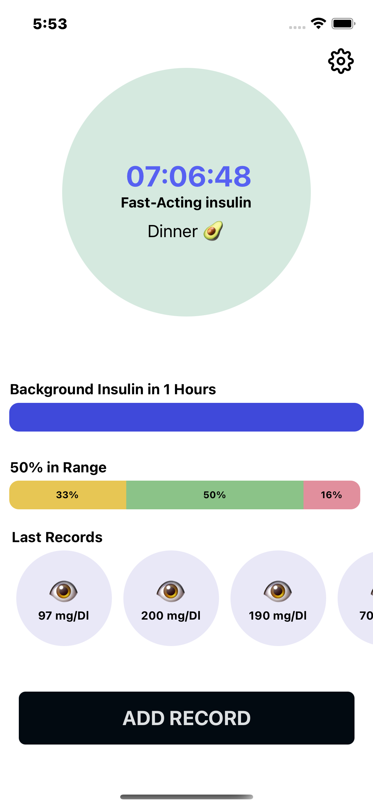

# Opencc

Help you manage Bolus/Basal insulin doses and keep tracking your daily data

## Images

|                          |                           |                              |                       |
| ---                      | ---                       | ---                          | ---                   |
|  |   |  |   |


 
 


## Server

Use [docker](https://docker.io/) to run Opencc on your server.

```bash
git clone https://github.com/brkss/opencc
```

```bash
cd opencc/server
```

```bash
chmod 755 deploy.sh
```

```bash
./deploy.sh
```

## App

Use expo to test / build Opencc


```bash
cd opencc/app
```

```bash
expo run:ios
```

or 

```bash
expo build:ios
```

